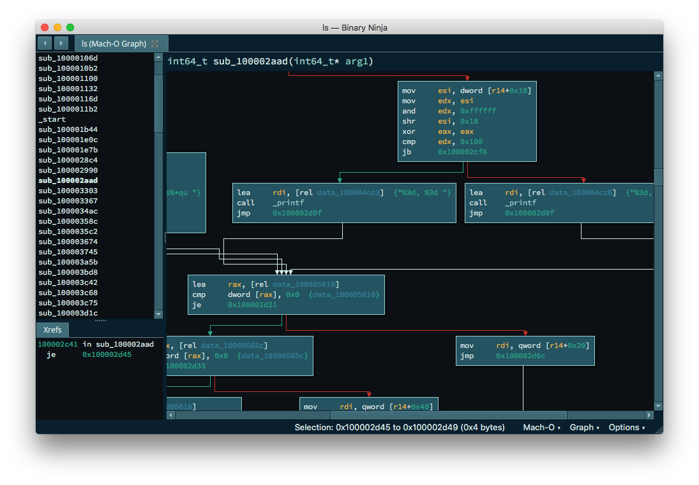
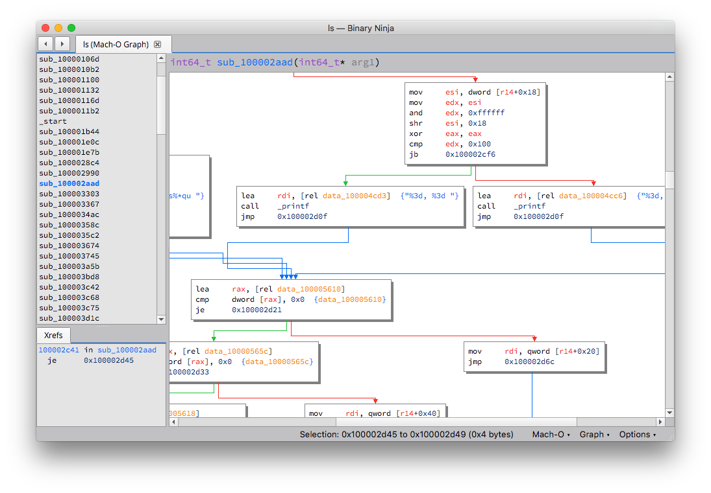
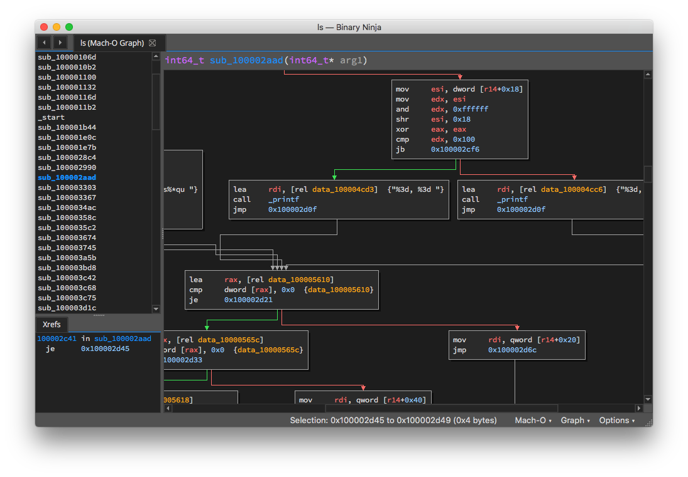
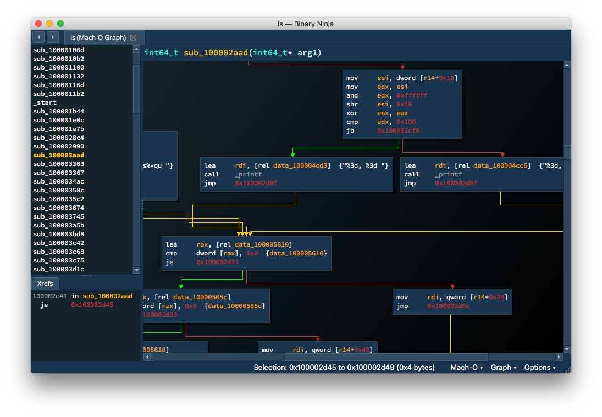
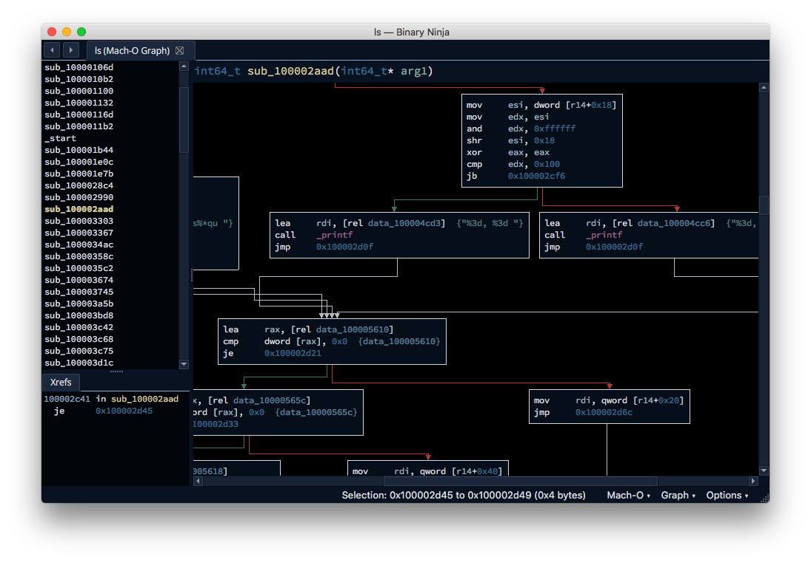
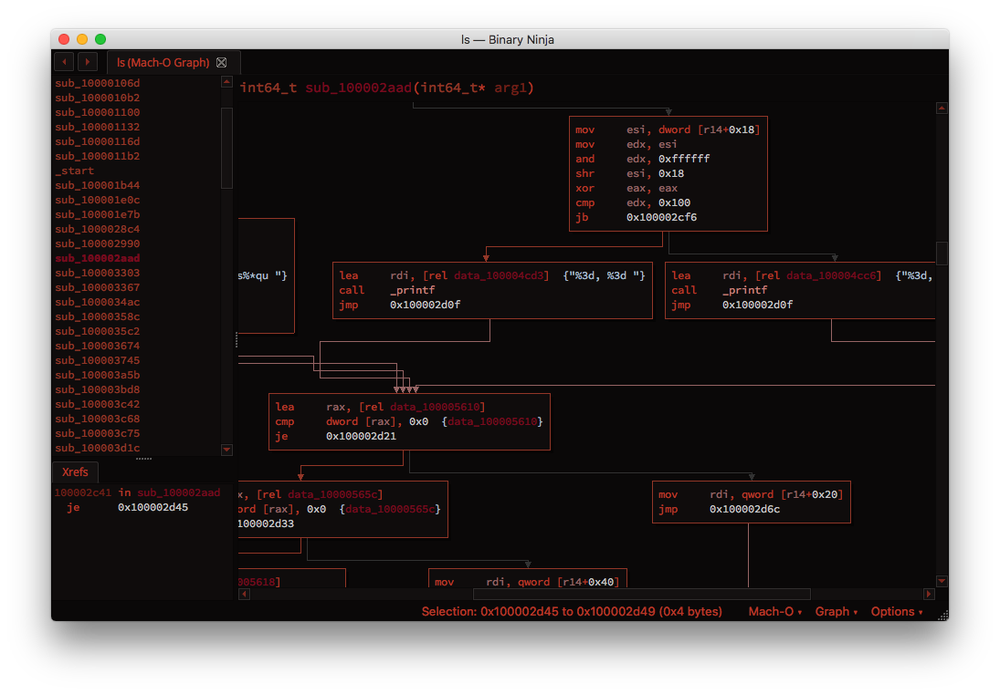

# Binary Ninja Community Themes

Welcome to the Binary Ninja Community Themes repository. 

To submit a theme, simply issue a [pull request]() adding your theme file. Sample themes are available from the [api repo](https://github.com/Vector35/binaryninja-api/tree/dev/themes).

## Themes

### Gotham

Gotham from [zznop](https://github.com/zznop)

### Life

Life from [Alexeyan](https://github.com/Alexeyan)

### No Life

No Life from [Alexeyan](https://github.com/Alexeyan)

### Photophore

Photophore from [Alexeyan](https://github.com/Alexeyan)

### Shatterdeep

Shatterdeep from [mechanicalnull](https://github.com/mechanicalnull)

### Throwback Green

Throwback Green from [mechanicalnull](https://github.com/mechanicalnull)

### Red Ninja

Red Ninja from [yhql](https://github.com/yhql)

